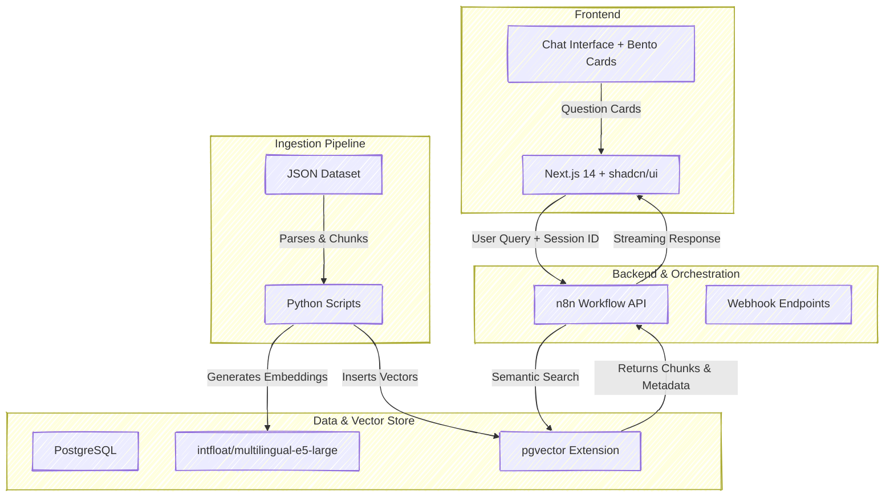

# 🚀 NASA BioScience RAG Engine 🧬

This project was developed as a submission for the **NASA Space Apps Challenge** in **24 hours** ⏱️. Our goal was to create a functional, AI-powered Retrieval-Augmented Generation (RAG) system to make complex NASA bioscience papers and data searchable through semantic similarity.

## 📚 Dataset

We are using **A list of 608 full-text open-access Space Biology publications** provided by NASA. This resource includes links to access 608 full-text space biology publications. The dataset is available as a CSV file containing titles and metadata for all publications, which we process and embed for semantic search capabilities.

## 💡 Architecture Overview

The system is built on a modern, modular stack designed for rapid deployment and efficient vector search. It combines a professional Next.js frontend with n8n backend orchestration, paired with specialized database and machine learning components.

### Architecture Map


## 🛠️ Technology Stack

| Component | Technology | Role |
|-----------|-----------|------|
| **Frontend** | Next.js 14 + TypeScript + shadcn/ui | Modern React-based chat interface with streaming responses, chat history, and Bento-style question cards. Features real-time AI conversations with session management. |
| **UI Components** | shadcn/ui + Tailwind CSS | Professional component library providing glassmorphism effects, responsive design, and dark theme optimized for space research. |
| **Backend Orchestration** | n8n | Handles the core workflow logic: receiving user queries with session IDs, triggering vector search via API, and orchestrating the RAG process with streaming responses. |
| **Database** | PostgreSQL | Primary relational database for storing document metadata and chat session data. |
| **Vector Store** | pgvector | PostgreSQL extension used to store high-dimensional vector embeddings, enabling fast nearest-neighbor searches (semantic search). |
| **Embedding Model** | intfloat/multilingual-e5-large | State-of-the-art embedding model used for converting text documents and search queries into dense vector representations. |
| **Ingestion/Data Prep** | Python | Used for data parsing, chunking of large documents, generating vector embeddings, and direct injection into the pgvector store. |

## 📂 Repository Structure

The project is organized into four main directories, separating the frontend code, backend workflows, data, and Python scripts.

| Directory | Content | Description |
|-----------|---------|-------------|
| `/backend` | `n8n_workflow.json` | Contains the exported JSON file for the n8n workflow, which defines the RAG API with webhook endpoints and search logic. |
| `/data` | `nasa_data.json`, `space_biology_publications.csv` | The raw, structured dataset of 608 NASA space biology publications used for ingestion and embedding. |
| `/scripts` | `.py files` | Python scripts responsible for the data pipeline: document parsing, chunking, embedding, and vector retrieval logic. |
| `/frontend` | Next.js 14 app, `package.json`, Dockerfile | Contains the complete Next.js application with shadcn/ui components, chat interface, API routes, and Docker configuration for containerized deployment. |

## 🎯 Key Features

### Frontend Features
- 🤖 **Real-time AI Chat**: Streaming conversations with biological science focus
- 🎨 **Modern UI**: Built with shadcn/ui components and Tailwind CSS dark theme
- 📱 **Fully Responsive**: Seamless experience across desktop, tablet, and mobile
- 🗂️ **Chat History**: Persistent session management with sidebar navigation
- 🎯 **Quick Questions**: Pre-built Bento-style cards for common research topics
- 🔗 **Source Citations**: Embedded research links in AI responses

### Backend Features
- ⚡ **Fast Semantic Search**: pgvector-powered nearest-neighbor searches
- 🔄 **Streaming Responses**: Real-time answer generation
- 📊 **Session Management**: Track and retrieve conversation history
- 🎯 **RAG Pipeline**: Retrieval-Augmented Generation for accurate, grounded responses

## 🏃 Getting Started (Local Setup)

### Prerequisites
- **Node.js** v18.0.0 or higher
- **PostgreSQL** with pgvector extension
- **n8n** instance (local or cloud)
- **Python** 3.8+ (for data ingestion)
- **Git** for version control

### Quick Start

1. **Clone the Repository**
   ```bash
   git clone https://github.com/limy-uk/bioscience-rag
   cd bioscience-rag
   ```

2. **Database Setup**
   - Ensure PostgreSQL is running with `pgvector` extension enabled
   - Create database for vector storage and metadata

3. **Data Ingestion**
   ```bash
   cd scripts
   # Install Python dependencies
   # Run ingestion scripts
   ```

4. **Backend Setup (n8n)**
   - Import `backend/n8n_workflow.json` into your n8n instance
   - Configure database connections in n8n workflow
   - Activate the workflow to enable API endpoints

5. **Frontend Setup**
   ```bash
   cd frontend
   # Install dependencies
   npm install
   # Configure environment variables
   cp .env.local.example .env.local
   # Edit .env.local with your n8n webhook URL
   # Start development server
   npm run dev
   ```
   
   The frontend will be available at [http://localhost:3000](http://localhost:3000)

### Detailed Frontend Setup

For comprehensive frontend setup instructions, environment configuration, and deployment options, see the **[Frontend README](./frontend/README.md)**.

### Production Deployment

- **Frontend**: Deploy to Coolify, Docker, or any Node.js hosting platform
- **Backend**: Host n8n workflow on your preferred platform
- **Database**: Use managed PostgreSQL with pgvector support


---

Built with ❤️ for NASA Space Apps Challenge 2025
